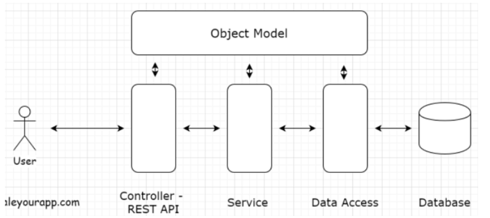
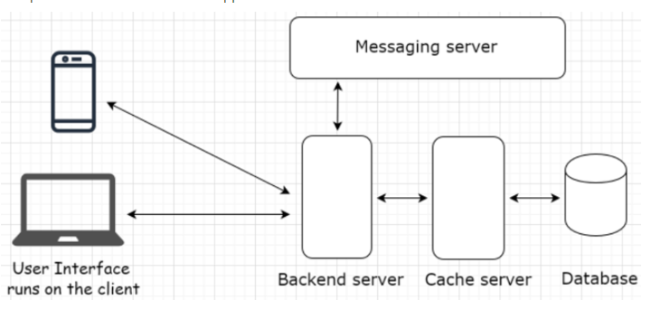
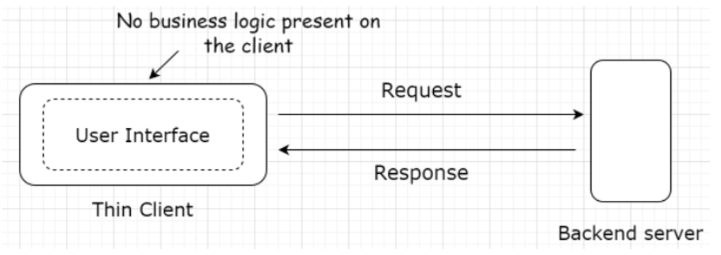
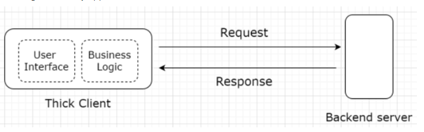

# Software Architecture

## Architecture Tiers

**What is a tier?** Logical and physical separation of components in an application or service. This separation is at a **component** level.

**What is a component?** Database, back-end server, user interface, messaging, caching, etc.

 

### Single Tier

**What is it?** In a single-tier application, the user interface, back-end logic, and database **reside in the same machine**.

**Examples:** MS Office, PC Games, image editing like Gimp and Photoshop

**Pros:**

1. No network latency, every **component** is located on the same machine. This makes data readily available.
    1. Other n-tier architectures have to send data requests to the back-end server often. This adds up network latency, making it slower.
2. Actual performance depends on the application's hardware requirements and how powerful the machine it runs on.
3. **Data privacy** and **safety** is of the **highest order** since data always stays in their machine and does not need to be transmitted over a network for **persistence of data**.

**Cons**:

1. Big downside is application's publisher has no control over the application. For patches/updates, customer must manually update it by connecting to the server.
    1. Ex. In the 90's, when a game was shipped with buggy code, studios could do nothing to fix it.
2. Code is very vulnerable and can be changed/reverse engineered. Someone can profit of it.

### Two Tier

**What is it?** Involves a client and a server. The **client contains the user interface *with business logic on one machine***. While the back-end server includes the database running on a different machine hosted by a business. This is also known as **client server architecture**.

This service largely depends on business requirements and use case. Moving the **business logic to a dedicated back-end server** turns it into a three tier application.

**Examples:** Web/mobile apps (to-do list, planner, productivity), web/mobile games, etc.

**Pros**

- The code is vulnerable but if it is accessed it won't cause the business harm
- **Business logic and UI resides in the same machine** so fewer network calls to the back-end server, keeping latency low.
    - **Examples:** To do-lists, the app only makes a call to the database server only when the user has finished creating their list and wants to **persist** the data.
    - Browser/mobile games, files are downloaded once the user uses the app for the first time but only make network calls to **persist game state**.
- Fewer server calls means less money spent to keep servers running.

### Three Tier

**What is it?** The user interface, business logic and database **all reside on different machines** thus have different tiers.

**Examples:** Largely used in the web (blogs, news websites, etc)

**Pros:**

- A three tier architecture works best for simple use cases
- A simple blog for example:
    - The user interface (**client**) will be written using HTML, Javascript, CSS
    - Back-end logic (**server**) will run on a server like Apache
    - **Database** will be MySQL

### N Tier

**What is it?** An application has more than three components (UI, back-end server, database)+

**These other components could be:** Cache, message queue (asynchronous behaviour), load balancers, search servers (searching massive amount of data), components involved in processing massive amounts of data, heterogeneous tech (web services, micro-services)

**Examples:**

Instagram, Facebook, Tiktok, Uber, Airbnb, Roblox, etc.

It is important for the two following software design principles:

#### Single Responsibility Principle

- Means giving one dedicated responsibility to a client and letting it execute flawlessly.
    - Saving data, running app logic, or ensuring delivery of the messages throughout system
- This gives a lot of flexibility making management easy. Can have dedicated teams and code repositories for individual components keeping things cleaner.
- Making a change to one component does not impact functionality in others
    - Ex. Upgrading a database server with a new operating system won't affect other components, if something happens with updates only the database will go down.
- Prevents us from using *stored procedures* in databases.
    - Database should not hold business logic, only used for **persisting data**
    - Should just have a separate tier to handle the business logic another way.

#### Separation of Concerns

- Allows members to only be concerned about their own work.
- Keeping components separate makes them reusable.
    - Different services can use the same database, messaging server, or any other component as long as they are not *tightly coupled*.
    - *Loosely coupled* components allows us to scale our service easily.

## Differences Between Layers and Tiers

- **Layers** are UI layer, business, service and data access layers
    
    
    
    - It represents conceptual organization of code
- **Tiers** are UI client, servers, database, messaging queues, load balancers, search servers, etc.
    - It represents the physical separation of components

  

# Web Architecture

**What is it?**

Involves multiple components like database, message queue, cache, UI client, etc. All running in conjunction to form an online service.

**Example:**

The picture below dictates a web application architecture.

## Client-Server Architecture

**What is it?** The client-server architecture is the one tier, two tier, three tier, and n tier architecture.

**How does it work?:**

- It works in a request-response model
    - *Client* sends a request to the server for information and the *Server* responds to it.
- Differs from a peer-to-peer architecture

### Client

**What is it?** Holds the user interface, it is the presentation part of the application written in HTML, Javascript, CSS.

**How does it work?:**

- UI runs on the client, it is the gateway of our application.
- Can be a mobile app, website, desktop, or tablet.
- It could use a variety of different technologies and frameworks including Javascript, jQuery, React, Angular, Vue, Svelte, etc.

**Different type of clients:** Thin and thick clients

---

#### Thin

**What is it?** A thin client just holds the user interface of the application and contains **no business logic**. For every action, the client sends a request to the backend server where the business logic is. Similarly to a **three-tier** application.

**Example:**

The picture below dictates how it works (three tier application), back-end logic resides in back-end server which connects to database.

#### Thick

**What is it?** Thick client holds all or some part of the business logic. Similarly to a **two-tier** application.

**Example:**

Online games, utility apps like to do, etc.

### Server

**What is it?** Receives requests from the client and provides a response after executing the business logic based on request parameters received from the client.

**How does it work?:**

- Every online service needs a server to run, aka application servers.
- Besides application servers, there are other kind of servers that run specific tasks
    - Includes: proxy, mail, file, virtual data storage, batch job servers.
- Server configuration can differ depending on the use case
    - **Example:** If we run a back-end application code written in Javas, we would pick *Apache Tomcat* or *Jerry*
    - For a hosting website, we would pick an *Apache HTTP Server*
- **Server-side rendering**, often devs use a server to render the user interface on the backend, then send the generated data to the client
    - **Example:** In an online game like VALORANT, if we buy a gun skin, it will show that gun skin to everyone in the game since the data has been persisted on the database.
- **Client-side rendering**, for one-tier or two tier applications, we may be rendering the user interface on the client
    - **Example:** In Runescape, users are able to use popular Cheat Engine to change the code of the business logic within the user interface to give themselves more money. However, it will only show on their client and not other clients since the data has not been persisted.