# Software Architecture

## Architecture Tiers

**What is a tier?** Logical and physical separation of components in an application or service. This separation is at a **component** level.

**What is a component?** Database, back-end server, user interface, messaging, caching, etc.

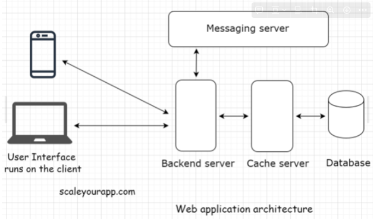
<br>

 ---

### Single Tier

**What is it?** In a single-tier application, the user interface, back-end logic, and database **reside in the same machine**.

**Examples:** MS Office, PC Games, image editing like Gimp and Photoshop

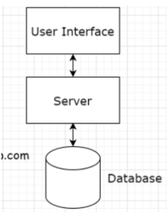

**Pros:**

1. No network latency, every **component** is located on the same machine. This makes data readily available.
    1. Other n-tier architectures have to send data requests to the back-end server often. This adds up network latency, making it slower.
2. Actual performance depends on the application's hardware requirements and how powerful the machine it runs on.
3. **Data privacy** and **safety** is of the **highest order** since data always stays in their machine and does not need to be transmitted over a network for **persistence of data**.

**Cons**:

1. Big downside is application's publisher has no control over the application. For patches/updates, customer must manually update it by connecting to the server.
    1. Ex. In the 90's, when a game was shipped with buggy code, studios could do nothing to fix it.
2. Code is very vulnerable and can be changed/reverse engineered. Someone can profit of it.
<br>

---

### Two Tier

**What is it?** Involves a client and a server. The **client contains the user interface *with business logic on one machine***. While the back-end server includes the database running on a different machine hosted by a business. This is also known as **client server architecture**.

This service largely depends on business requirements and use case. Moving the **business logic to a dedicated back-end server** turns it into a three tier application.

**Examples:** Web/mobile apps (to-do list, planner, productivity), web/mobile games, etc.

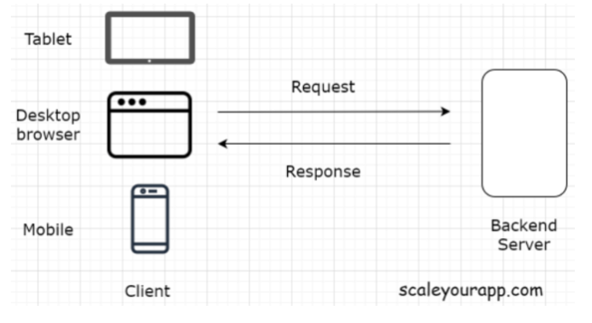

**Pros**

- The code is vulnerable but if it is accessed it won't cause the business harm
- **Business logic and UI resides in the same machine** so fewer network calls to the back-end server, keeping latency low.
    - **Examples:** To do-lists, the app only makes a call to the database server only when the user has finished creating their list and wants to **persist** the data.
    - Browser/mobile games, files are downloaded once the user uses the app for the first time but only make network calls to **persist game state**.
- Fewer server calls means less money spent to keep servers running.
<br>

---

### Three Tier

**What is it?** The user interface, business logic and database **all reside on different machines** thus have different tiers.

**Examples:** Largely used in the web (blogs, news websites, etc)

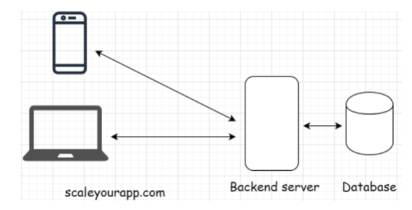

**Pros:**

- A three tier architecture works best for simple use cases
- A simple blog for example:
    - The user interface (**client**) will be written using HTML, Javascript, CSS
    - Back-end logic (**server**) will run on a server like Apache
    - **Database** will be MySQL

### N Tier

**What is it?** An application has more than three components (UI, back-end server, database)+

**These other components could be:** Cache, message queue (asynchronous behaviour), load balancers, search servers (searching massive amount of data), components involved in processing massive amounts of data, heterogeneous tech (web services, micro-services)

**Examples:**

Instagram, Facebook, Tiktok, Uber, Airbnb, Roblox, etc.

It is important for the two following software design principles:

#### Single Responsibility Principle

- Means giving one dedicated responsibility to a client and letting it execute flawlessly.
    - Saving data, running app logic, or ensuring delivery of the messages throughout system
- This gives a lot of flexibility making management easy. Can have dedicated teams and code repositories for individual components keeping things cleaner.
- Making a change to one component does not impact functionality in others
    - Ex. Upgrading a database server with a new operating system won't affect other components, if something happens with updates only the database will go down.
- Prevents us from using *stored procedures* in databases.
    - Database should not hold business logic, only used for **persisting data**
    - Should just have a separate tier to handle the business logic another way.

#### Separation of Concerns

- Allows members to only be concerned about their own work.
- Keeping components separate makes them reusable.
    - Different services can use the same database, messaging server, or any other component as long as they are not *tightly coupled*.
    - *Loosely coupled* components allows us to scale our service easily.

## Differences Between Layers and Tiers

- **Layers** are UI layer, business, service and data access layers
    
    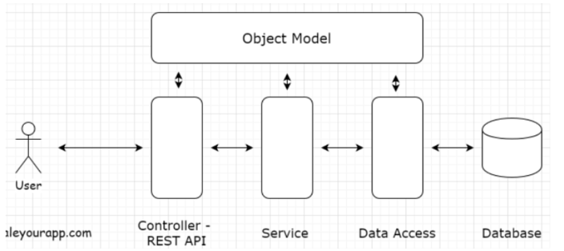
    
    - It represents conceptual organization of code
- **Tiers** are UI client, servers, database, messaging queues, load balancers, search servers, etc.
    - It represents the physical separation of components

<br><br>


# Web Architecture

**What is it?**

Involves multiple components like database, message queue, cache, UI client, etc. All running in conjunction to form an online service.

**Example:**

The picture below dictates a web application architecture.

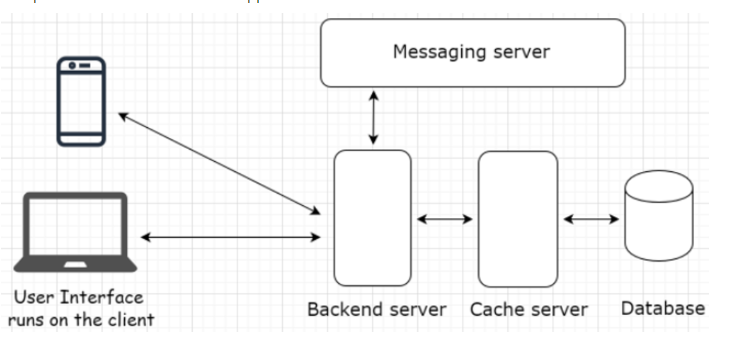

## Client-Server Architecture

**What is it?** The client-server architecture is the one tier, two tier, three tier, and n tier architecture.

**How does it work?:**

- It works in a request-response model
    - *Client* sends a request to the server for information and the *Server* responds to it.
- Differs from a peer-to-peer architecture

### Client

**What is it?** Holds the user interface, it is the presentation part of the application written in HTML, Javascript, CSS.

**How does it work?:**

- UI runs on the client, it is the gateway of our application.
- Can be a mobile app, website, desktop, or tablet.
- It could use a variety of different technologies and frameworks including Javascript, jQuery, React, Angular, Vue, Svelte, etc.

**Different type of clients:** Thin and thick clients

---

#### Thin

**What is it?** A thin client just holds the user interface of the application and contains **no business logic**. For every action, the client sends a request to the backend server where the business logic is. Similarly to a **three-tier** application.

**Example:**

The picture below dictates how it works (three tier application), back-end logic resides in back-end server which connects to database.

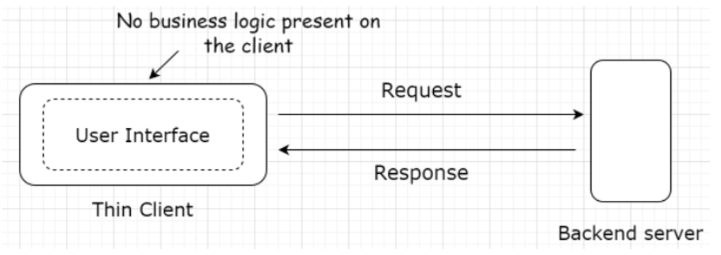

---

#### Thick

**What is it?** Thick client holds all or some part of the business logic. Similarly to a **two-tier** application.

**Example:**

Online games, utility apps like to do, etc.

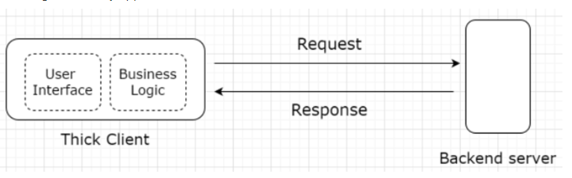
<br>

### Server

**What is it?** Receives requests from the client and provides a response after executing the business logic based on request parameters received from the client.

**How does it work?:**

- Every online service needs a server to run, aka application servers.
- Besides application servers, there are other kind of servers that run specific tasks
    - Includes: proxy, mail, file, virtual data storage, batch job servers.
- Server configuration can differ depending on the use case
    - **Example:** If we run a back-end application code written in Javas, we would pick *Apache Tomcat* or *Jerry*
    - For a hosting website, we would pick an *Apache HTTP Server*
- **Server-side rendering**, often devs use a server to render the user interface on the backend, then send the generated data to the client
    - **Example:** In an online game like VALORANT, if we buy a gun skin, it will show that gun skin to everyone in the game since the data has been persisted on the database.
- **Client-side rendering**, for one-tier or two tier applications, we may be rendering the user interface on the client
    - **Example:** In Runescape, users are able to use popular Cheat Engine to change the code of the business logic within the user interface to give themselves more money. However, it will only show on their client and not other clients since the data has not been persisted.
<br>

## Client-Server Communication

**What is it?** It uses the request-response model, the *client* sends the request and the *server* responds. If there is no request then there is no response.

**How does it work?:** It works using the following:

- HTTP Protocols
    - Entire communication happens over HTTP protocol (request-response protocol), used for data exchange over the world wide web.
    - Defines how the information is transmitted over the web.
- REST API and API Endpoints
    - Modern n-tier web applications, every *client* has to hit a REST endpoint to fetch the data from the backend.
    - Backend application code has a REST API implemented.
    - **Example:**
        
        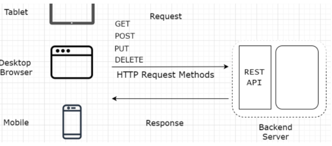
        
        - Objective:
            - Let's say we want to write an application to keep track of birthdays to all Facebook friends and send a reminder beforehand.
        - Implementation:
            - First step is to get ALL of the birthdays of our friends
                - Write a client to hit the *Facebook Social Graph API* which is a REST API to get the data then run business logic on the data.
<br>

---

### REST API

**What is it?** Stands for *Representational State Transfer*. It is an architectural style for implementing web services.
https://www.youtube.com/watch?v=_YlYuNMTCc8

**How does it work?:**

- It acts as an interface
- Takes advantage of HTTP methodologies to establish communication between the client and the server.
- Allows servers to cache the response to improve application performance.
- It is a **stateless process**, meaning communication between client and server is a *new* one.
    - No information or memory is carried over from previous communications.
    - ***So everytime the client interacts with the server, the authentication must also be sent with it.***

---

#### Rest Endpoints

**What is it?** Means URL of the service that the client could hit: `https://myservice.com/users/{username}` for fetching user details of a particular user.

1. **GET** (Retrieve a list of books or a specific book): **THERE IS ALSO PATH/QUERY STRINGS SEE BELOW**
    
    ```jsx
    // Get all books
    app.get('/api/books', (req, res) => {
        // Logic to fetch and return all books
    });
    
    // Get a specific book by ID
    app.get('/api/books/:id', (req, res) => {
        // Logic to fetch a book by req.params.id
    });
    ```
    
2. **POST** (Create a new book):
    
    ```jsx
    app.post('/api/books', (req, res) => {
        // Logic to create a new book from req.body
    });
    ```
    
3. **PUT** (Update a specific book):
    
    ```jsx
    app.put('/api/books/:id', (req, res) => {
        // Logic to update an existing book using req.params.id and req.body
    });
    ```
    
4. **DELETE** (Delete a specific book):
    
    ```jsx
    app.delete('/api/books/:id', (req, res) => {
        // Logic to delete a book using req.params.id
    });
    ```
    
5. **PATCH** (Partially update a specific book):
    
    ```jsx
    app.patch('/api/books/:id', (req, res) => {
        // Logic to partially update a book using req.params.id and req.body
    });
    ```
    
6. **OPTIONS** (Discover communication options for the API):
    
    ```jsx
    app.options('/api/books', (req, res) => {
        // Logic to return the supported HTTP methods for the /api/books endpoint
        res.header('Allow', 'GET, POST, PUT, DELETE, PATCH, OPTIONS').send();
    });
    ```
    
7. **HEAD** (Retrieve headers for a specific book resource):
    
    ```jsx
    app.head('/api/books/:id', (req, res) => {
        // Logic to fetch headers for a book using req.params.id
        // The body of the response should be empty
    });
    ```
    

**Front End code**

1. **Front-End Code for Path Parameter Example with Axios (GET a specific book):**
    
    Fetching a specific book by its ID using a path parameter:
    
    ```html
    <script src="https://cdn.jsdelivr.net/npm/axios/dist/axios.min.js"></script>
    <script>
        function getBookById(bookId) {
            axios.get(`/api/books/${bookId}`)
                .then(response => {
                    console.log('Book:', response.data);
                    // Handle the book data (e.g., display it on the page)
                })
                .catch(error => console.error('Error:', error));
        }
    
        getBookById('1'); // Example: Fetch the book with ID '1'
    </script>
    
    ```
    
2. **Front-End Code for Query String Example with Axios (GET books with optional filters):**
    
    Fetching books with optional filters like author and year using query strings:
    
    ```html
    <script src="https://cdn.jsdelivr.net/npm/axios/dist/axios.min.js"></script>
    <script>
        function getBooksByFilter(author, year) {
            const params = {};
            if (author) params.author = author;
            if (year) params.year = year;
    
            axios.get('/api/books', { params })
                .then(response => {
                    console.log('Filtered Books:', response.data);
                    // Handle the filtered books data (e.g., display it on the page)
                })
                .catch(error => console.error('Error:', error));
        }
    
        getBooksByFilter('Author A', 2001); // Example: Fetch books by 'Author A' published in 2001
    </script>
    
    ```
    

**Back End code**

1. **Path Parameters**: These are used to identify a specific resource. They are part of the URL path.
    
    ```jsx
    // Example: GET /api/books/:bookId
    app.get('/api/books/:bookId', (req, res) => {
        const bookId = req.params.bookId;
        // Logic to retrieve the book with the given bookId
    });
    ```
    
    In this case, **`:bookId`** is a path parameter that would be replaced with the actual ID of the book you want to retrieve.
    
2. **Query Strings**: These are used for filtering, searching, or detailed specification of the request, usually in GET requests.
    
    ```jsx
    // Example: GET /api/books?author=JKRowling&published=1997
    app.get('/api/books', (req, res) => {
        const author = req.query.author;
        const publishedYear = req.query.published;
        // Logic to retrieve books based on author and published year
    });
    ```
    
    Here, **`author`** and **`published`** are query parameters that can be used to filter the books based on the author's name and the year they were published.
    

#### Helps Decouple Clients & Backend Service

Back-end service does not have to worry about client implementation. It just tells clients that "*Here is a URL address of the resource/information you need. Hit it when you need it. Any client with the required authorization can access it.*"

Developers can have different implementations for different clients, allowing to leverage different technologies. This means clients and backend service are ***decoupled***.
<br>

---


### HTTP Push and Pull

**What is it?** There are two different modes of data transfer between client and server, HTTP PUSH and HTTP PULL.

**How does it work?:**

- HTTP PULL
    - The client sends the request and the server responds with the data
        - This is the ***default mode*** of HTTP communication called HTTP PULL
    - The client *pulls* the data from the server whenever required and does it repeatedly to fetch the latest data.
    - One *important* thing to note, each request to the server and the response ***consumes bandwidth***.
        - This costs the business money and adds to the load on the server.
    - ***What if there is no data available on the server every time the client sends a request?***
        - The client wouldn't know this so it would keep sending requests over and over.
        - Excessive pulls by clients have potential to bring down the server.
        - Examples: Normal Polling
    - Ajax long polling is also used here, it will do requests at intervals
- HTTP PUSH
    - To fix the issue if no data is available on the server every time the client sends a request, HTTP PUSH mechanism is used.
        - The client can send just one request just once.
        - After the first request, the ***server will keep pushing new updates to the clients whenever they are available***.
    - The client does not have to worry about sending additional requests to the server for data.
        - Saves a lot of network bandwidth.
    - A common example are *user notifications*, we get notified whenever an event happens on the backend.
    - Clients use Asynchronous Javascript & XML (AJAX) to send requests to the server in both HTTP PULL and PUSH mechanism.
    - **Multiple technologies:**  Web Sockets, HTML5 Event Source, Message Queues, Streaming over HTTP

--- 

#### PULL, Ajax Long Polling

**What is it?** There are two ways of pulling/fetching data from the server, using a manual HTTP GET request to the server using a user interface OR *pulling data dynamically at regular intervals using AJAX without human intervention* AKA polling.

Long polling is different to normal polling. Uses both HTTP Push and HTTP Pull based on BAYEUX protocol while normal polling just uses HTTP Pull.

**How does it work?:**

- Uses AJAX (Asynchronous Javascript & XML), used for adding asynchronous behaviour to the web page.
    
    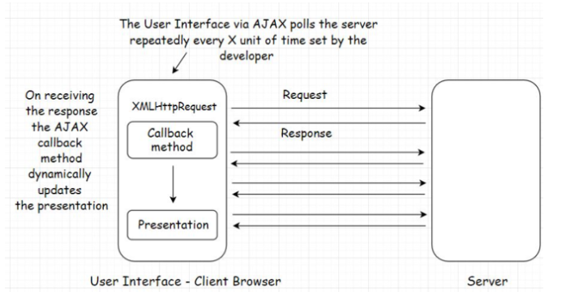
    
    - As shown above, instead of requesting data manually, we fetch the updated data from the server by sending requests in intervals.
        - In React, this could be as simple as using the `useInterval` hook.
        https://blog.bitsrc.io/polling-in-react-using-the-useinterval-custom-hook-e2bcefda4197
    - Upon receiving a response, a particular section of the web page will dynamically change by the *callback method*.
- Uses *XMLHttpRequest* to send requests to the server, this object is built in the browser and uses Javascript to update the HTML DOM
- Most commonly used in jQuery framework to implement asynchronous behaviour on the UI.

---

#### PUSH

**How does it work?:** Using time to live, persistent connection, and heartbeat interceptors allows us to keep pushing data to the client when it is available.
<br>

##### Time to Live (TTL)

- Time to Live (TTL)
    - In a regular client-server communication which is HTTP PULL, there is a TTL for every request. It could be 30 to 60 secs depending on browser.
    - If the client does not receive a response within the TTL, the browser kills the connection and client has to re-send the request hoping it receives the data before TTL ends again.
        - Open connections consumes resources and there is a limit to number of open connections on a server at once.
        - **If connections don't close, the server will run out of memory, hence why TTL is used.**
    - *What if we are certain that the response will take more time than the TTL set by the browser?*

---

##### Persistent Connection

- It is a network connection between client and server that remains open for future requests and responses
    
    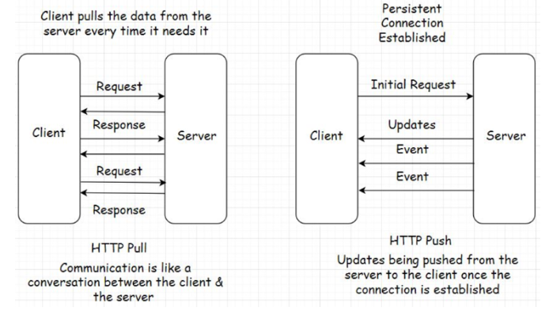
    
- If the response will take more time than the TTL, the we need a *persistent connection* between client and server.
- If the frequency of request and response between client and server is too high then we also need a *persistent connection*.

**Implemented by using:** We can implement a long opened connection using AJAX long polling, web sockets, server-sent events, etc.

---

###### Heartbeat Interceptors

- Heartbeat Interceptors
    - *How is a persistent connection possible if the browser kills the open connections to the server every x seconds?*
    - With the help of *heartbeat interceptors* we are able to keep the connection open
    - **These are just blank request responses between client and server to prevent the browser from killing the connection**
- This is very **resource intensive**, it will consume a lot of resources compared to HTTP Pull behaviour.
    - But there could be uses cases where we need to use a persistent connection that is vital for an app.
    - **Example:** A browser-based multiplayer game has a large amount of request-response activity within a small timeframe, it would be smart to establish a persistent connection between client and server
<br>

---

#### Technologies for Long Opened Connection

##### Web Sockets

**What is it?** For client-server bi-directional low latency data flow.
**Examples:** Messaging, chat applications, real-time social streams, browser based multiplayer games. Apps that contain a significant number of read writes compared to a regular web app.

**How does it work?:**

- Uses TCP/IP connection instead of HTTP. **Full Duplex Communication**.
- Server and client should both support web sockets
- Connection steps:
    - Client requests an HTTP request (GET) to the server asking to open a connection
    - If the server accepts then it creates a 101 switching protocols response
    - This will complete the handshake opening the TCP/IP connection that allows for *bi-directional messaging*
    - Communication stays open until one of the parties drop (client or server) then TCP resources can be unallocated

---

##### AJAX Long Polling

**What is it?** *Long polling* is between AJAX and Web Sockets. Instead of requesting data manually, we fetch the updated data from the server by sending requests in intervals.
**Examples:** Dynamically update web pages asynchronously.

**How does it work?:**

- Instead of immediately returning an empty response, the server will hold the response until it finds an update to be sent to the client.
    - As opposed to normal polling where it receives a response instantly which could be an empty response
- Connections in long polling stays open a bit longer than normal polling. If the connection breaks, the client has to re-establish the connection with the server.
- Fewer requests sent to the server than regular polling which cuts down network bandwidth consumption.
- Can be used in simple asynchronous fetch when you don't want to poll the server.

---

##### HTML 5 Event-Source API & Server Sent Events (SSE)

**What is it?** Server sent events (SSE) automatically pushes the data to the client when updates are available. *It does not wait for any polling requests*. Incoming messages from the server are treated as events.
**Examples:** Real-time Twitter feed, displaying stock quotes, real-time notifications.

**How does it work?:**

- Servers can send data to the client once the client has established a connection with an initial request.
    - Helps eliminate blank request-responses cutting down network bandwidth consumption
- It is only ***one-direction communication*** from *server to client*
    - As opposed to websockets where it is bi-directional
- To implement
    - Back-end language must support it
    - Front-end UI, HTML5 Event-Source API will be used to receive the data from the server

---

##### Streaming over HTTP

**What is it?** For cases where we need to stream extensive data over HTTP by breaking it into smaller chunks. Made possible using HTML5 and Javascript Stream API.
**Examples:** Multimedia content (large images and videos) over HTTP

**How does it work?**

- Allows us to watch a partially downloaded video as it downloads by the playing the downloaded chunks on the client.
- Both client and server must agree to conform to the streaming settings to stream data.
    - Helps determine when the stream begins and ends over an HTTP request-response model
- Differences between REST API and Streaming API:
    
    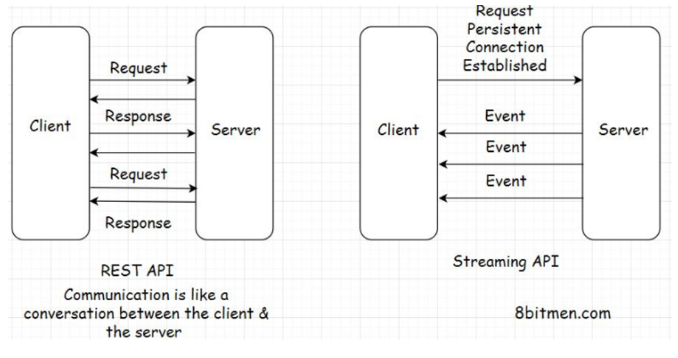
<br><br>

---

### Client-Side vs Server-Side Rendering

#### Client-Side Rendering

**What is it?** When a browser receives a web page from the server in response, it has to render the response on the window in the form of an HTML page.

**How does it work?:**

- To render the web page, the browser has several components: browser engine, rendering engine, Javascript interpreter, Networking and UI backend, Data storage, etc.
- Browser does a lot of work to convert the response from the server into an HTML page.
- This takes some time before the user can interact with the page.
- Use cases:
    - Modern websites are highly dependent on AJAX, contents for a page has to be fetched and rendered asynchronously.
        - This won't work for *server-side rendering* since for every AJAX request it will generate the *entire page* on the server rather than updating the certain content on the page in response for client rendering. Which is very *resource intensive* and consume bandwidth.
    - Can combine both server-side rendering for static content and client-side rendering for dynamic content.

---

#### Server-Side Rendering

**What is it?** Ensures faster rendering of the UI, averting the UI loading time in the browser window because the page is already created and the browser doesn't have to do much assembling and rendering work.

**How does it work?:**

- Developers may render the UI on the server, generate the HTML there then directly send the HTML page to the UI.
- Number of concurrent users on the website goes up, server-side rendering will exert an unnecessary load on the server as it is continuously generating the page on the server with more users.
- Use cases:
    - Perfect for delivering static content like WordPress blogs.
    - Good for SEO, crawlers easily read generated content.
    - **Can combine both server-side rendering for static content and client-side rendering for dynamic content.**
<br><br>
    
## Web Hooks

To use the Webhooks, consumers register an HTTP endpoint with the service with a unique API Key. It’s like a phone number. Call me on this number when an event occurs. I won’t be calling you anymore.

Whenever new information is available on the backend, the server fires an HTTP event to all the registered endpoints of the consumers, notifying them of the latest update.

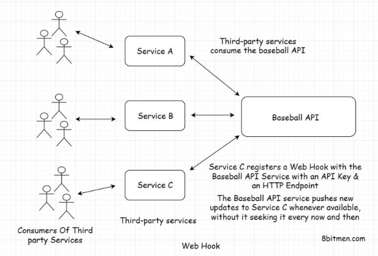

Browser notifications are one example of Webhooks. Instead of visiting the websites every now and then for new info, they notify us when they publish new content.