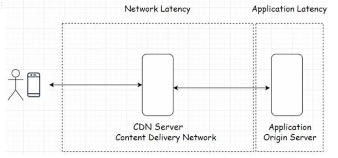
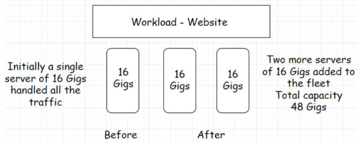

# Scalability

**What is it?**

Means the application's ability to handle and withstand increased workload without sacrificing performance.

**Example:**

If an app takes x seconds to respond to a user request. It should take the same x seconds to respond to each of your app's million concurrent users.

*Be able to handle heavy traffic load and maintain system **latency***
 

## Latency

**What is it?**

Latency is the time a system takes to respond to a user request. In successful apps, no matter the traffic load the latency should not go up.

**Example:**

In terms of big O notation. Ideally we want something O(1) which is constant time like a map or a key-value database. If something is O(n^2) then it is not scalable because as the size of the data set increases, the slower the program becomes.

---

### Measuring Latency & Solutions

**How does it work?:**

- Latency is measured by the time difference between the action that a user takes and the response to that action. Like clicking a button or scrolling down a web page.
- Divided into two parts:
    
    
    
    - **Network latency**
        - Time that the network takes to send a data packet from point A to point B.
        - Network should be efficient enough to handle increased traffic load.
            - Solution: Use a CDN to deploy servers across the globe as close to the end-user as possible. AKA *Edge* locations.
    - **Application latency**
        - Time that the application takes to process a user request.
        - Again should also be efficient enough to handle increased traffic load.
            - Solution: Run stress and load tests on the application and scan for bottlenecks that slow down the system as a whole.

**Why is it important?:**

- Latency plays a big role in finding out if an online business wins or loses a customer. This online age makes us very impatient.
    - If something is too slow, the customer will find the information off another website.
- Examples:
    - In an MMO game, a slight lag in-game ruins whole experiences. Reaction times are very important.
    - Algorithmic trading services need to process events in milliseconds.
  

## Types of Scalability

An application needs solid computing power, servers should be powerful enough to handle increased traffic loads.

---

### Vertical Scaling

**What is it?** It means to add more power to our server. 
**Example:** Our app is hosted by a server with 16 gigs of RAM. To handle load, we augment the RAM to 32 gigs. Here we have *vertically* scaled the server.

**How does it work?:**

- We augment the power of the hardware running the app, this is the simplest way to scale as it doesn't require code refactoring or for complex configurations.
- There is a limit to the compute power we can augment for a single server.
    - Why?: Imagine a multi-story building. If we keep adding floors and more people need to live in the building, we can't raise the number of floors to the moon.
    - Solution: Build more buildings, this is where *horizontal* scalability comes in.
- When traffic is too large to be handled by one server, we bring in more servers to work together.
- Significant downside: ***Availability*** risk, making our servers powerful but if we have few in number, there is a risk of that server going down and the entire website going offline. Another reason for *horizontal scalability*.

---

### Horizontal Scaling

**What is it?**

It means to add more servers to the existing hardware resource pool. This increases the computational power of the system as a whole.

**Example:**

**How does it work?:**

- We can now efficiently handle increased traffic influx.
- No limit to how much we can scale horizontally. We can keep adding servers and setting up data centers.
- Allows for ***high availability***.
- It allows us to scale dynamically in real-time as the traffic in the website climbs.
    - ***Dynamic scaling is not possible when scaling vertically.***

---

### Cloud Elasticity

**What is it?** Most prominent reason why cloud computing is mainstream is the ability to *scale dynamically*. Process of adding, removing, stretching and returning back to original infrastracture on the fly is *cloud elasticity*.

**How does it work?:**

- As traffic climbs, we are able to add additional servers to the *hardware resource pool*, and if it drops, we remove servers.
- Gives us the concept of ***high availability***
    - Multiple server nodes on the back end helps the website stay online even if some server nodes crash