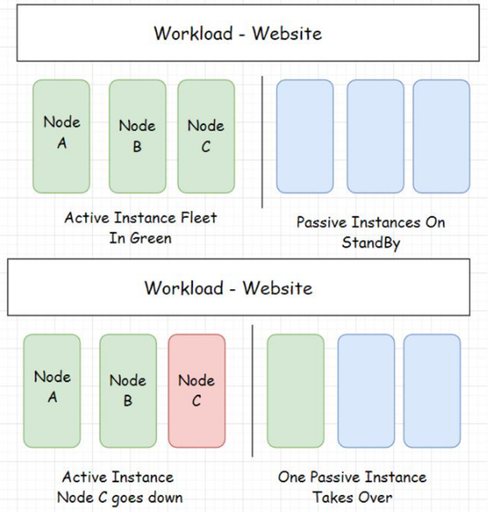
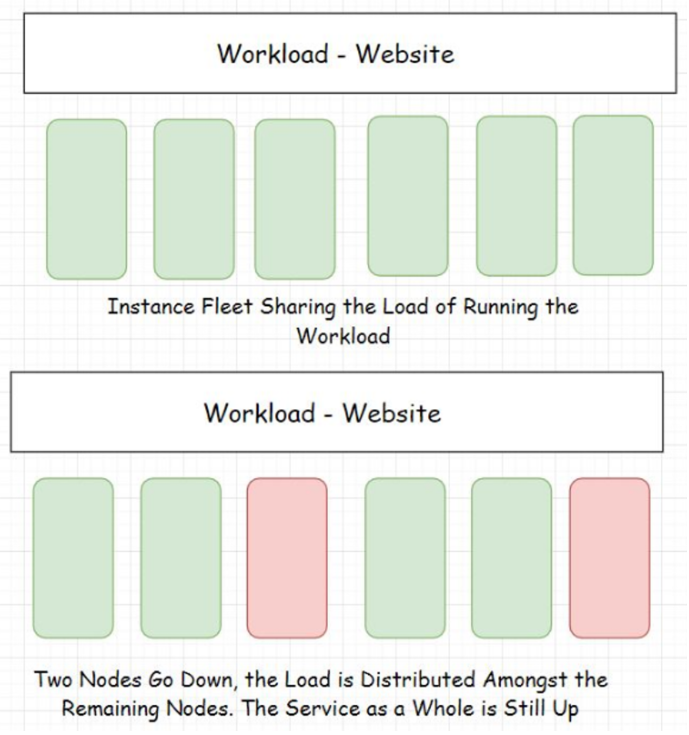
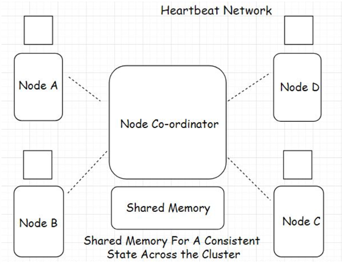

# High Availability

**What is it?** *AKA **HA***. The ability of the system to stay online despite having failures at the infrastructure level. It is often expressed as a ***percentage***. You might often see this in *Service Level Agreements* (SLA) of cloud platforms.
 **Example:** A real world example is having back-up generators to ensure power in case of any power outages in hospital, air traffic control towers, etc.

**Why is it important?:**

- There are mission critical systems like aircrafts, spacecrafts, mining machines, hospital servers and stock market systems that cannot afford to go down. Lives pretty much depend on it.
- To meet high availability requirements, systems are designed to be ***fault tolerant*** and **redundant**.
 

## Reasons for System Failures

- Software crashes
    - Dealing with corrupt software files.
    - BSOD, OS crashing, memory hogging unresponsive processes.
    - Software running on cloud nodes crashes unpredictably and takes down the entire node.
- Hardware failures
    - Overloaded CPU and RAM, hard disk failures, nodes going down, and network outages.
- Human errors
    - Flawed configurations, Ex.Google made a tiny network configuration error and it took down almost half of the internet in Japan.
- Planned downtime
    - Routine maintenance operations, patching software, hardware upgrades.
 

## Achieving High Availability

### Fault Tolerance

**What is it?** A systems ability to stay up despite taking hits. It is an essential element in life-critical systems. 
**Example:** Social networking platforms, in the case of back-end node failures. A few services of the app such as image upload, post likes, etc., may stop working. However, the application as a whole will still be up. Known as *fail soft*.

**How does it work?:**

- A fault-tolerant system can be designed at the ***application*** and ***deployment level***.
- Application level
    - The entire massive service must be architecturally broken down into more granular loosely coupled services called ***microservices***.
    - Many upsides of splitting a big monolith into several microservices.
        - Easy management and maintenance, ease of deployment, ease of adding new features to a service without affecting other services, scalability and high availability of the system.
    - Every microservice takes the onus of running different features of an application such as:
        - Photo upload
        - Comment system
        - Instant messaging
        - Groups, Marketplace, etc.
    - In this case, even if a few services go down, the other services of the application are still up.
- Deployment level
    - See ***redundancy*** below for the deployment level.

---

### Redundancy

**What is it?**

Duplication of server instances and keeping them on standby to take over in case any of the active server instances go down. It is the fail-safe mechanism in the *deployment level*.

**Example:**

The picture below shows redundant instances. One of the redundant instances takes over when the active instances goes offline. This is known as the ***Active-passive HA*** **mode**.

Systems like GPS, aircraft, communication satellites have zero down-time with the use of making components redundant.

**How does it work?:**

- **It prevents *single points of failure***
    - In ***monolithic*** architecture, there are single points of failure that could drop a whole application down which is why the use of *distributed systems* like ***microservices*** facilitate a *fault-tolerant* architecture.
    - In a *HA* system, a large number of *distributed server nodes* work in conjunction to achieve a single synchronous application state.
    - When many redundant nodes are deployed, there are no single points of failure in the system. In case a node goes down, a redundant node can take its place.
    - Single points of failure at the application level mean **bottlenecks**.
        - Remember having just one monolithic database handling requests from a number of application nodes could be a big issue in *high latency*.
- **Provides monitoring and automation**
    - System should be well monitored in real-time to detect any bottlenecks or single points of failures.
    - **Automation** enables the instance to **self-recover without any human intervention**. Power of *self-healing*.
        - No more human error.
    - System becomes intelligent enough to add or remove instances on the fly. ***Kubernetes*** is a good example of this.

---

### Replication

**What is it?**

Having a number of *similar nodes running the same workload together*. No standby or passive instances. When a single node or a few nodes go down, the remaining nodes bear the load of the service. AKA ***Active-active HA mode***.

**Example:**

The picture below is the Active-active high availability mode. All server instances are active at any point in time.

---

### Geographical Distribution of Workload

- As a contingency to natural disasters, regional power outages, and other big-scale failures. Data center workloads are spread across different data centers across the world.
- Helps eliminate single point of failures
- Reduces latency significantly due to proximity of data the user needs to access.
- **Example implementation**
    - Businesses often use multi-cloud platforms to deploy workloads
    - Ensures further availability if things go bad with one cloud provider.

---

### High Availability Clustering

**What is it?** AKA ***fail-over cluster***. Contains a set of nodes running in conjunction with each other to ensure HA of the service.

**Example:**

A **single state** across all nodes in a cluster is achieved with the help of a shared distributed memory* and a distributed coordination service like Zookeeper. The picture below is a ***heartbeat network*** that continuously monitors health and status of each node in the cluster.

**How does it work?:**

- HA clusters use several techniques such as
    - disk mirroring
    - Redundant Array of Independent Disks (RAID)
    - redundant network connections/electrical power
- Multiple HA clusters run together in one geographical zone ensuring minimum downtime and continual service.