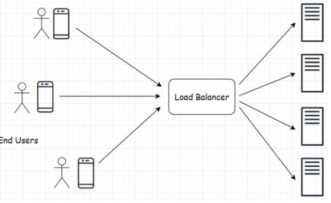
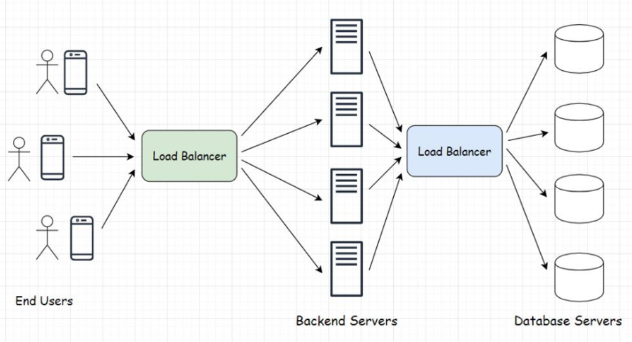
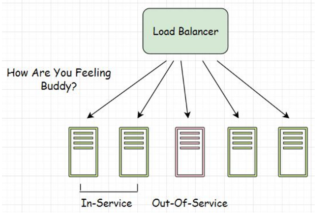
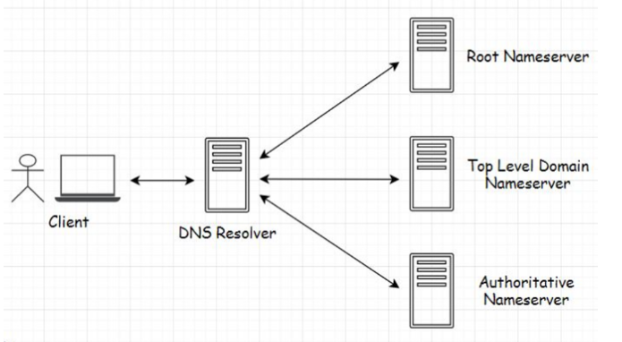
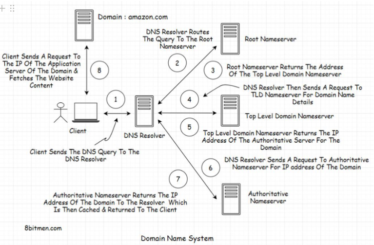

# Load Balancing

**What is it?** Enables our service to scale well and stay highly available when traffic load increases. ***Acts as a single point of contact for all client requests***.

**Example:**

While processing a user request, if a server goes down, the load balancer automatically routes the future requests to up and running server nodes in the cluster.

**How does it work?:**

- Distributes heavy traffic load across the servers running in the cluster based on several algorithms.
    - Averts the risk of all traffic converging into a single or few machines in the cluster.
    - ***Preventing an overload or a spike in latency***.
- They can also be set-up at the *application component level*
    - Allows us to efficiently manage traffic directed towards any application component
        - The back-end application server
        - Database component
        - Message queue, etc.
    - It will uniformly spread the request load across the machines in the cluster powering the particular component:
        
        
        
- Allows us to perform health checks of the servers
    - To intelligently route the user requests to the active nodes in the cluster, it should be aware of the running status of the server.
    - Therefore, load balancers regularly perform health checks on the machines in the cluster:
        
        
        
    - It will maintain the list of machines that are up and running and those requests are only forwarded to the healthy machines AKA ***in-service machines***.
    - Servers that are down are known as ***out-of-service instances***.
    - Once the out-of-service instance comes back, it will go back to the list.
  

## Understanding DNS

**What is it?** Stands for *Domain Name System* (DNS), it is a system that averts the need to remember long IP addresses to visit a website by mapping easy-to-remember domain names to IP addresses.
 **Example:** `amazon.com` is a domain name that is mapped to a unique IP address.

**How does it work?:**

- When a user types in the URL of the website in their browser and hits enter, this event is known as ***DNS querying***.
- Four key components make up the DNS infrastructure:
    
    
    
    - DNS Recursive name server AKA *DNS Resolver*
    - Root nameserver
    - Top-Level Domain nameserver
    - Authoritative nameserver

---

### DNS Query Process

**How does it work?:**

- **Step 1)** The role of the *DNS Resolver* is to receive the client request and forward it to the *Root nameserver* to get the address of the Top-Level domain nameserver.
    - The DNS Resolver is managed by the Internet Service Provider (ISP).
        - DNS is a ***distributed system*** setup in large data centers.
        - These data centers contain clusters of servers optimized to process *DNS queries* in minimal time.
- **Step 2)** Once DNS Resolver ***forwards*** the request to the Root nameserver, the Rootname server returns the address of the Top-Level domain nameserver.
    - Example: It could return `google.com`
- **Step 3)** Once the DNS Resolver ***receives*** the address of the *top-level domain nameserver*. It sends a request to the top level domain name server to fetch the details of the domain name.
    - Example: The `.com` top-level domain nameserver will contain info on domains using `.com`.
- **Step 4)** Since the domain is `google.com` it will route the request to the `.com` *top level domain name server*.
- **Step 5)** Once the *top-level domain name server* receives the request from the *DNS resolver*, it ***returns the IP address*** of `google.com`.
- **Step 6)** `google.com` *domain nameserver* is the last server in the DNS query lookup process. Also known as the ***Authoritative nameserver***.
- **Step 7)** The *DNS Resolver* fires a query to the *Authoritative nameserver*, and it returns the IP address of `google.com` to the DNS Resolver.
- **Step 8)** DNS Resolver caches the data and forwards it to the client.
- **Step 9)** On receiving the response on the client, the browser sends a request to `google.com` IP address to fetch data from the servers with things like the HTML, minified JS/CSS, etc.
- **Step 10)** Most of the time the DNS information is cached, so there is less rerouting to do every time a client requests an IP address.
    - DNS information of websites that we visit also gets cached in local machines with a TTL.

---

### DNS Load Balancing

**What is it?** Enables the *Authoritative server* to return different IP addresses of a particular domain to the clients.

**How does it work?:**

- Every time it receives a query for an IP, it returns a list of IP addresses of a domain to the client.
    - The order of the IP addresses changes in a round-robin fashion.
    - It returns a list of IP addresses to allow the client to use other IP addresses in case the first doesn't return a response in a stipulated time.
- The first IP address on the list will fetch data from the website unless it doesn't return a response.
- When a client hits an IP, it may not necessarily hit an application server right away
    - It may hit another load balancer implemented at the data center level that manages clusters of application servers.

**Limitations:**

- Largely used by companies to distribute traffic across multiple data centers that the application runs in. But there are limitations.
- Does not take into account:
    - the load on the servers,
    - the content they hold,
    - their requests processing time
    - in-service status, etc.
- Since IP addresses are cached by the clients machine and the DNS resolver, there is always a possibility of a request being routed to a machine that is out of service.
- Although with limitations, it is still preferred by companies. It is an easy and less expensive way of setting up load balancers on their service.
  

## Methods

There are different methods for hardware and software load balancing.

### Hardware Load Balancers

**What is it?** Highly performant physical hardware. They sit infront of application servers and distribute the load based on the number of currently open connections to a server, compute utilization and serveral other parameters.

**How does it work?:**

- These load balancers are physical hardware so they require maintenance and regular updates.
- Compared to *software load balancers*,
    - upkeep requires a skillset.
    - Expensive to set-up
    - Overprovisioned upfront to deal with peak traffic.
- But if it comes to ***performance***, hardware load balancers stand out.

---

### Software Load Balancers

**What is it?** Can be installed on commodity hardware and VMs. Routes traffics across machines using many parameters such as data hosted by the servers, cookies, HTTP headers, CPU and memory utilization, load on the network, etc. to route traffic across servers.
**Example:** ***HAProxy*** is an example of a software load balancer, widely used by big guns in the industry including GitHub, AWS, StackOverflow, etc.

**How does it work?:**

- Compared to *hardware load balancers*,
    - Cost-effective
    - Offer more flexibility to developers
    - Upgraded and provisioned very easily.
- Load Balancers as a Service (LBaaS), enables you to directly plug in load balancers into an application without having any sort of setup.
- Performs health checks on servers to keep an updated list of ***in-service*** machines.
- Besides the *round-robin* algorithm that DNS load balancers use, software load balancers leverage several other algorithms to route traffic across machines.

---

### Algorithms Used

#### Round-robin/Weighted Round-robin

**What is it?** Sends IP addresses of machines sequentially to the clients. Parameters such as server load, CPU consumption are not considered.
**Example:** DNS load balancers uses round-robin algorithm to send a list of IP addresses and changes the order with each request.

**How does it work?:**

- There is another approach known as ***weighted round-robin***
    - This algorithm uses weights on the server's compute and traffic handling capacity
    - More traffic is converged to machines that can handle a higher traffic load
    - Useful when the service is deployed across multiple data centers having different compute capacities.
    - Traffic can be re-directed to the larger data centers containing more machines.

---

#### Least Connections

**What is it?** Traffic is routed to the machine with the least open connections of all machines in the cluster.

**How does it work?:**

- Two different approaches to implement this:
    - **Approach 1:** Assumed that all requests will consume an equal amount of server resources, and the traffic is routed to the machine with least open connections based on this assumption.
        - Possibility that the machine might already be processing requests demanding most of its CPU which is bad.
    - **Approach 2:** Machines with the shortest request processing time, most negligible CPU utilization, and the least open connections are suitable candidates to process future client requests.
- This comes in handy when the server has long opened connections like ***persistent connections*** in a gaming app.

---

#### Random

**What is it?** Traffic is randomly routed to the servers. The load balancer may also find similar servers in terms of existing load, request processing time, etc. Then randomly routes the traffic to these machines.

---

#### Hash

**What is it?** The source IP where the request is coming from and the request URL are hashed to route the traffic to the back-end servers.

**How does it work?:**

- ***Hashing the source IP*** ensures that a clients request will always be routed to the same server.
    - Gives a better user experience as the server already processed the initial client requests.
    - No need to fetch the client session data from the session memory of the cluster and process their request
    - Reduces latency
- ***Hashing the client IP*** enables the client to re-establish the connection with the same server in the event that a connection drops.
- ***Hashing the URL*** ensures that requests with that URL always hits a certain cache that already has data on it.
    - Ensures no cache miss
    - Averts the need for duplicating data in every cache