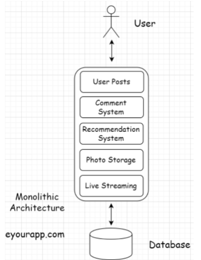
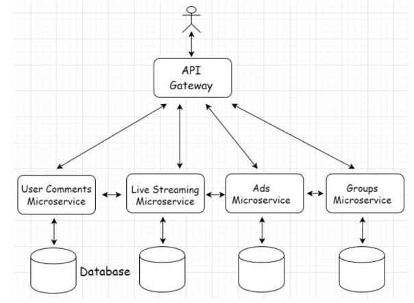
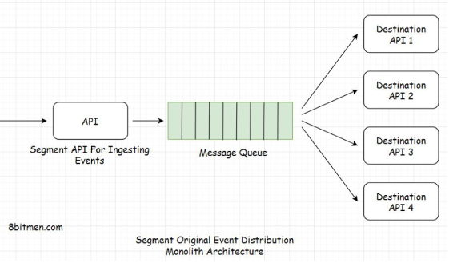
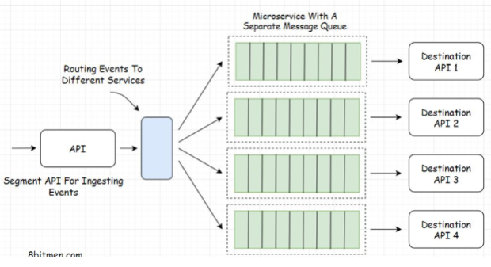

# Monolith & Microservices

## Monolithic Architecture

**What is it?** An application has a monolithic architecture if it contains the entire application in a single code base. Self-contained, tightly coupled software application.
 **Examples:** In Facebook, it contains many different features such as: User posts, Comment system, Groups, Marketplace, Portal Ads, Photo storage, Live-streaming. 
In a monolithic architecture, all of these features will be coded in a *single codebase tightly coupled* with each other as opposed to having one or more dedicated microservice for running respective features.https://microservices.io/patterns/monolithic.html

**How does it work?:**

- It is very simple to build, test and deploy in comparison to a microservices architecture.
- During *initial stages of a business*, it ***begins in a monolithic architecture then branches out into a distributed microservices later***.
    - This is a *trade-off*
    - We need to keep in mind, code-refactoring which is a technical debt moving tightly coupled to separate microservices requires a lot of time and resources.
    - **Example:** LinkedIn moved from monolithic to distributed systems.
- In the present landscape:
    - Applications are built and deployed on the cloud and business move fast.
    - A wise decision is to pick a loosely coupled stateless microservices architecture from the start if we expect to grow at a rapid pace in the future.
- However, if requirements are simple, monolithic architecture would be best as microservices may be overkill.

---

### When to pick Monolithic, Pros/Cons

- Requirements must be pretty simple and the application is not complex, like a to-do app, sports news, internal tax calculation app, etc.
- **Pros:**
    - Simplicity
        - Easy to deploy, monitor and manage. Everything is in *one repository*.
    - No need for heterogeneous tech
        - When the entire back-end of the project can be easily implement with a single technology
- **Cons:**
    - Continuous Deployment
        - Pain in monolithic applications as even a minor code change in a certain application layer or a feature requires a re-deployment of the entire application.
    - Regression testing
        - In the event of re-deployment the entire application, we need to perform a *regression testing* of the whole app.
        - A minor code change in one feature can potentially impact functionality of other features due to components being *tightly coupled*
    - Single points of failure
        - A bug in any of the application features can bring down the entire application.
    - Scalability issues
        - Maintenance and scalability is a challenge in monolith apps
        - As code size increases, it gets harder to manage
    - Cannot leverage heterogeneous tech
        - Building complex apps in a monolith is tough
            - We wont be able to leverage multiple technologies and programming languages to create features in an app.
            - There will be multiple compatibility issues
    - Not cloud-ready, holds state
        - Monolithic apps hold state in static variables so it is not *cloud-ready*
        - For an app to be cloud-native, it has to have a consistent behaviour so it has to be ***stateless***.
  

## Microservice Architecture

**What is it?**

Different features of an extensive service are deployed separately as smaller loosely coupled services.

**Example:**

Facebook uses microservices for different services like user comments, live streaming, ads, groups

**How does it work?:**

- Similarly to N-tier architecture, the two software-design principles come to affect:
    - **Separation of concerns**
        - Every service has a responsibility of running a specific feature
    - **Single responsibility**
- Makes the app cleaner, easier feature development, testing and deployment of individual modules.
- When a project is large, it is managed by serveral different teams to deploy separate modules/features.
- It is also a lot easier to scale since the components are *loosely coupled*
- Every ***microservice ideally has a separate database***, eliminating *single points of failure and system bottlenecks*.

---

### When to pick Microservices, Pros/Cons

- It is best fit for complex use cases, apps that need to expand quick from adding new features standpoint like a social network.
- **Pros**:
    - No single points of failure
        - Since it is loosely coupled architecture
        - If a few services go down, the application as a whole would still be up
    - Leverage the heterogenous technologies
        - Every microservice interacts wiith each other via a REST API gateway.
        - It can leverage ***polyglot persistance architecture*** and other ***mixed technologies*** like Java, Python, Ruby, NodeJS, etc.
        - *Polyglot persistence* uses multiple databases like SQL and NoSQL.
    - Independent and continuous deployments
        - We can have dedicated teams for every microservice
        - Can be scaled independently without impacting other services
- **Cons:**
    - Management complexity
        - A distributed environment with several services powered by clusters of servers makes management complex
        - Set-up additional components to manage microservices, such as node manager like Apache Zookeeper.
        - Need to have a DevOps team.
    - Strong consistency
        - Strong consistency is hard to guarantee in a distributed environment.
        - Trying to achieve a single consistent state across all services is tough.
  
    
## Trade-offs

### Fault Isolation

- In microservices, it becomes easier to isolate faults and debug them.
    - We are able to pin-point a bug to a specific service without the need to scan the entire codebase.
    - Also known as *fault isolation*.

---

### Deployment Team Autonomy

- In monolithic architecture
    - Number of developers and teams working on a single codebase grows beyond a certain number, it may slow the productivity and velocity of teams.
    - Size of the codebase increasing, compile and tests run-time increase as well.
        - Due to entire codebase needing to be compiled after a code change
    - A code change may break functionality in multiple different places
    - After code is pushed to production, all teams need to stop working until the change is pushed
        - Code pushed requires approvals from other teams, this is a **bottleneck**
- In microservice architecture
    - Dedicated teams have complete ownership of codebases
    - CI/CD autonomy over their modules
    - The need to move fast and quickly launch features to the market at scale is easier
    - ***Increase in complexity* has** **technical debt**
        - Comes the need to setup; distributed logging, monitoring, inter-service communication, service discovery, tracing, alerts, dedicated built and release pipelines, health checks, etc.

---

### Segment - Monolith to Microservices back to Monolith

- Segment is a customer data platform that initially started as monolith, then split into microservices back as the business gained traction they moved back to monolith.
- Their architecture looked something like this:
    
    
    
    - In a monolithic, all events were moved to a single queue.
    - **Issue:** Events often failed to deliver to destinations and were retried by the queue after stipulated time intervals.
        - This made the queue contain **both new and failed events waiting to be retried**.
        - This resulted in **delays** in the delivery of events to destinations.
- **Why move to microservices?**
    - Split their monolith into microservices for fault isolation and easy debugging of issues
    - There were single points of failure that they wanted to steer away from
    - Now every service contained its own individual distributed message queue, ***helping cut down load on a single queue***:
        
        
        
        - Now when a certain queue got flooded, it didn't impact the event delivery of other services. This is **fault isolation**.
- **What happened?**
    - Segment integrates data from many different providers into their systems.
    - ***As business gained traction, they had to create a separate microservice for every data provider***
    - ***This led to a major increase in the number of microservices thus increasing the complexity of their architecture***
    - Operational overhead became resource-intensive and slowed the organization immensely
- **Solution**
    - Moving back to monolith, they gave up fault isolation and other pros of microservices
    - They now use a single code repository called ***Centrifuge*** that handles billions messages per day delivered to multiple APIs