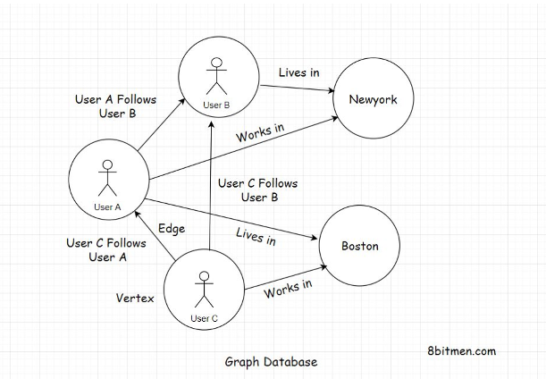
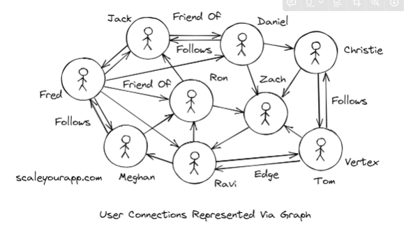

# Types of Data

## Structured Data

**What is it?** Type of data that conforms to a certain structure. Stored in a database in a *normalized* fashion. 
**Example:** Customer stored in a database row. The `customerId` would be an `integer type`, `name` would be a `string type`, `age` would be `integer type`.

**How does it work?:**

- Does not need any sort of data preparation before it can be interacted.
- Every column of a database row has pre-defined rules for data that is meant to be ***persisted*** in it.
    - We know the exact type we are dealing with
    - So if we are working on a `string type` then we can run string operations without worries of errors
- Managed by SQL (structure query language)
 

## Unstructured Data

**What is it?**

Has no definite structure. It is a mixed type of data consisting of text, image files, videos, pdfs, blob, word documents, etc.

**Example:**

This kind of data is great when running ***data analytics***, where we receive data streams from multiple different sources like IoT devices, social networks, web portals, sensors, etc.

**How does it work?:**

- Cannot directly interact with unstructured data.
    - We need to make it flow through a preparation stage and segregates based on business logic to extract information.
 

## Semi-structured Data

**What is it?** A mix of structured and unstructured data. Often stored in data transport formats like XML, JSON.
 

## User State

**What is it?** Contains the information of activity the user performs on the website.
**Example:** In an e-commerce website: user browses through several products, sorts products, clicks on recommended products, adds items to wish list, etc. These are all user states.

**How does it work?**

- Storing user state helps business improve UX.
- Persisting user state allows us to also continue where they left off on the next log-in.
  

# Types of Databases

## Relational Databases

**What is it?** Persists data containing relationships: 1 to 1, 1 to many, many to many, many to one. It uses a data model and data is organized in tables having rows and columns and is interacted using SQL.
**Example:** MySQL, PostgreSQL. Apps like Facebook and LinkedIn.

**How does it work?**

- **Data consistency**
    - Data is saved in a normalized fashion.
    - ***Normalized data*** occurs in only one table in its simplest and atomic form and is not spread throughout the database.
        - Updating a table should only affect that table and not other tables in the database
    - Helps maintain consistency
        - If we need to update data we can just update it in one place.
        - As opposed to updating the entity throughout multiple tables which could prove *inconsistency*.
    - Example:
        1. **Initial Table - "Customers":**
            - Before normalization, you have a single table "Customers" with the columns: “CustomerID”, “CustomerName”, “Address”, “City”, “State”, and “Zip”.
            - The issue with this structure is that it can lead to data redundancy. For example, if the same customer has multiple addresses, their name will be repeated for each address.
        2. **Normalization Process:**
            - The goal is to divide the data into two tables to reduce redundancy and improve the organization.
        3. **Creating "Customers" and "Addresses" Tables:**
            - **"Customers" Table**: This table is simplified to hold only customer-related information, i.e., “CustomerID” and “CustomerName”. Each customer has a unique ID.
            - **"Addresses" Table**: This table holds address-related information: “AddressID”, “Address”, “City”, “State”, and “Zip”. Importantly, it includes an “AddressID” which is a unique identifier for each address.
        4. **Linking Tables with a Foreign Key:**
            - To maintain the relationship between customers and their addresses, the tables are linked.
            - This can be done by adding a “CustomerID” column to the “Addresses” table. Each entry in the “Addresses” table relates to a customer in the “Customers” table.
            - The “CustomerID” in the “Addresses” table acts as a foreign key referencing the “CustomerID” in the “Customers” table.
        5. **Benefits of This Normalization:**
            - **Reduces Redundancy**: A customer's name is stored only once in the “Customers” table, no matter how many addresses they have.
            - **Improves Data Integrity**: Changes to a customer's name only need to be made in one place.
            - **Flexibility**: Easily accommodate customers with multiple addresses.
        6. **Illustration with Sample Data:**
            
            "Customers" Table:
            
            | **CustomerID** | **CustomerName** |
            | --- | --- |
            | 1 | John Doe |
            | 2 | Jane Smith |
            
            "Addresses" Table:
            
            | **AddressID** | **CustomerID** | **Address** | **City** | **State** | **Zip** |
            | --- | --- | --- | --- | --- | --- |
            | 101 | 1 | 123 Main St | Townville | TX | 12345 |
            | 102 | 2 | 456 Oak Ave | Cityside | NY | 23456 |
            | 103 | 1 | 789 Pine Rd | Lakeview | CA | 34567 |
            
            Here, John Doe (CustomerID 1) has two addresses (AddressID 101 and 103), but his name is stored only once in the “Customers” table.
            
        
        This normalization approach, typically up to the third normal form, is a common practice in relational database design, striking a balance between reducing redundancy and maintaining efficient data access.
        
- **ACID transactions**
    - Atomicity, Consistency, Isolation, Durability (ACID)
    1. **Atomicity**:
        - **Concept**: Transactions are all-or-nothing. This means every operation within the transaction must succeed; if any part of the transaction fails, the entire transaction fails and the database state is left unchanged.
    2. **Consistency**:
        - **Concept**: Transactions must bring the database from one valid state to another valid state, maintaining all predefined rules, such as constraints, cascades, and triggers.
    3. **Isolation**:
        - **Concept**: Transactions are isolated from each other until they’re complete. The results of a transaction are not visible to other transactions until the transaction is committed.
    4. **Durability**:
        - **Concept**: Once a transaction has been committed, it is permanent, even in the event of a system failure.
    
    **ACID Transaction Example - Bank Account Transfer:**
    
    - **Scenario**: Transferring $100 from Account A to Account B.
    - **Steps in the Transaction**:
        1. Begin the transaction.
        2. Debit $100 from Account A.
        3. Credit $100 to Account B.
        4. Commit the transaction.
    - **ACID Properties Applied**:
        - **Atomicity**: If any step fails, say debiting from Account A succeeds but crediting to Account B fails, the whole transaction is rolled back. Account A is returned to its original state as if the transaction never happened.
        - **Consistency**: The transaction will ensure that the total amount across both accounts remains the same. It adheres to the rule that money can neither be created nor destroyed during the transaction.
        - **Isolation**: Until the transaction is committed, no other transaction can see the intermediate steps (like the money debited but not yet credited).
        - **Durability**: Once the transaction is committed and $100 has moved from Account A to Account B, this change is permanent. Even if the system fails immediately after, this change will not be lost.
    
    **Conclusion:**
    
    - The system transitions from State A (before transaction) to State B (after transaction), maintaining consistency. State A and State B are both valid and consistent states of the database.

---

### When to pick relational databases

- When you need:
    - **Strong consistency**
        - Some examples are stock trading and personal banking
    - **Transactions** (ACID)
    - **Relationships** (1 to 1, 1 to many, many to 1, many to many)
- **Transactions and data consistency**
    - Software that has anything to do with money or numbers and contains transactions.
        - ***ACID*** and ***consistency*** is very important
    - Relational DBs comply with the ACID rule
- **Large community**
    - Seasoned engineers on the tech are readily available.
- **Storing relationships**
    - If we require a ton of relationships, like:
        - a social network app
        - knowing what friends live in a particular city or what restaurant they ate in
 

## NoSQL Database

**What is it?** Essentially a JSON-based database built for Web 2.0 that is unstructured data.
 **Example:** Used for high-frequency read/writes like real-time sport apps, MMO's, micro-blogging, etc.

**How does it work?:**

- **Scalability**
    - One big limitation in SQL is scalability.
        - SQL databases needs to be sharded, replicated to make them run smoothly on a cluster.
        - Needs careful planning, human intervention and a certain skillset.
    - As opposed to NoSQL
        - Databases can add new server nodes on the fly very easily without any human intervention.
    - Nowadays, there are billions of users connected with each other on social networks.
    - Massive amount of data is generated every microsecond, and we need infrastructure to manage exponential growth.
- **Ability to run on clusters**
    - NoSQL databases are designed to run intelligently on clusters (no human intervention)
        - Allows to scale horizontally over a cluster and across data centers
    - However, it sacrifices: strong consistency, ACID transactions
        - Instead it uses: ***eventually consistent***
        - Many NoSQL systems adhere to the CAP theorem, which states that a distributed data system can only simultaneously provide two of the following three guarantees: Consistency, Availability, and Partition Tolerance. **NoSQL databases often prioritize Availability and Partition Tolerance, sometimes at the expense of strong Consistency.**
        - This leads to the concept of "eventual consistency," where the database does not guarantee immediate consistency across all nodes but assures that all changes will propagate over time, resulting in consistency at a later point.

### Pros/Cons

- **Pros**
    - **Learning curve is not steep and schemaless**
        - More *flexibility* as opposed to SQL databases where our time needs to go in designing well-normalized tables and setting up relationships.
        - You don't have to be a *pro* at database design
    - **Fast lookup**
        - Instead of a SQL query, we can fetch the JSON object using its key
        - Allowing for a constant O(1) operation.
- **Cons**
    - **Inconsistency**
        - Data is not normalized which introduces risk of it being inconsistent.
        - Hard for DEVs to remember all locations of an entity in the database leads again to inconsistency
    - **No support for ACID transactions**
        - Limited to a certain entity hierarchy or a small deployment region where they can lock down nodes to update them.

---

### When to pick a NoSQL Database?

- Handling a large number of read-write operations
    - The ability to add nodes on the fly allows them to handle more concurrent traffic
    - Built to handle big data with minimal latency
    - Scalability is very easy
- Flexibility with data modelling
    - Expectation of things changing at a rapid pace and unsure of data model during initial phase
- Eventual consistency over strong consistency
- Running data analytics
 

---

### Is NoSQL More Performant Than SQL?

- From a performance benchmarking standpoint, SQL and NoSQL stand side-by-side
    - What matters the most is how we design our systems to **leverage** one of the two

 

## Document-Oriented Database

**What is it?** Leading types of NoSQL databases. It stores data in a document-oriented model in independent documents. The data is generally semi-structured and stored in a JSON-like format.

**Examples:** MongoDB, CouchDB, OrientDB, Google Cloud Datastore, and Amazon DocumentDB.

**Why should I choose it?:**

- Need a flexible schema that will change often
    - Unsure about the database scheme at the beginning and needs to change over time
- The need to scale fast and stay highly available
    - Provides horizontal scalability and performant read-writes since they cater to CRUD use cases.
    - These includes cases where we don’t need complex relational logic and need quick persistence and data retrieval.

## Graph Database

**What is it?** Part of the NoSQL family. It stores data in nodes/vertices and edges in the form of relationships. Each node in a graph DB represent an entity and each edge represents the relationship between entities.

**Why use it?**

- There may come a time when relationships stored in a relational DB become way too slow to query.
    - Too many joins across multiple tables
- Graph data model allows for data to be accessed with low latency
- When you need to store complex relationships

**Examples:**

- Relationships between users in social networks
    - Facebooks graph search feature uses graph data structure.
    
    
    
    - The relationships are multi-dimensional, the network maps links between users and their favorite restaurants, cuisines, sports teams, etc.
    - These relationships allow for recommendations of where to travel, dine, etc.
    - **How does it work?**
        - Adjacency matrix helps figure out if a relationship between two nodes exists in O(1)
            - If the nodes in a graph contain a lot of edges, we represent it with adjacency matrix
            - If edges are sparse then we represent the graph using adjacency list
        - Graphs are traversed using search algorithms DFS, BFS.
            - DFS is used to find: paths and connectivity between nodes, cycles
            - BFS is used to find the shortest path between nodes

## Key-Value Database

**What is it?** Part of the NoSQL family, uses a simple key-value pairing method to store and quickly fetch data with minimum latency.

**Examples:** Redis, Hazelcast, Riak, Volemort, and Memcached.

**Why should I choose it?:**

- Ensures constant O(1) time to be used for caching application data
- Used to achieve a consistent state in distributed systems
- Caching, persisting user state and sessions, managing real-time data, implementing queues and create leaderboards in online games

## Time Series Database

**What is it?** Optimized for tracking and persisting data that is continually read and written in the system over a period of time. *Time-series data* is data containing points associated with the occurrence of events with respect to time. It is generally ingested from IoT devices, self-driving vehicles, sensors, social networks, stock markets, etc.

It is primarily used for running analytics and deducing conclusions. Helping stakeholders make future business decisions by looking at analytic results.

**Why should I choose it?:**

- Need to manage data in real time, continually over a long period of time
- Built to deal with streaming data in real-time
- Need data for analytics

## Wide-Column Database

**What is it?** Belong to NoSQL family and are used to handle massive amounts of data, typically called *Big Data.*

Wide-column databases store data in a record with a dynamic number of columns. A record can hold billions of columns.

**Examples:** Cassandra, HBase, Google Bigtable, etc.

**When to pick?:**

- When we need to work with massive amounts of data
- Ensuring scalability, performance and high availability when managing Big Data