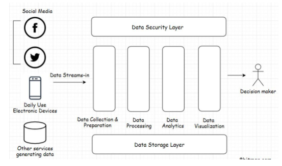

# Types of Data

## Structured Data

**What is it?** Type of data that conforms to a certain structure. Stored in a database in a *normalized* fashion. 
**Example:** Customer stored in a database row. The `customerId` would be an `integer type`, `name` would be a `string type`, `age` would be `integer type`.

**How does it work?:**

- Does not need any sort of data preparation before it can be interacted.
- Every column of a database row has pre-defined rules for data that is meant to be ***persisted*** in it.
    - We know the exact type we are dealing with
    - So if we are working on a `string type` then we can run string operations without worries of errors
- Managed by SQL (structure query language)
 

## Unstructured Data

**What is it?**

Has no definite structure. It is a mixed type of data consisting of text, image files, videos, pdfs, blob, word documents, etc.

**Example:**

This kind of data is great when running ***data analytics***, where we receive data streams from multiple different sources like IoT devices, social networks, web portals, sensors, etc.

**How does it work?:**

- Cannot directly interact with unstructured data.
    - We need to make it flow through a preparation stage and segregates based on business logic to extract information.
 

## Semi-structured Data

**What is it?** A mix of structured and unstructured data. Often stored in data transport formats like XML, JSON.
 

## User State

**What is it?** Contains the information of activity the user performs on the website.
**Example:** In an e-commerce website: user browses through several products, sorts products, clicks on recommended products, adds items to wish list, etc. These are all user states.

**How does it work?**

- Storing user state helps business improve UX.
- Persisting user state allows us to also continue where they left off on the next log-in.
  

# Types of Databases

## Relational Databases

**What is it?** Persists data containing relationships: 1 to 1, 1 to many, many to many, many to one. It uses a data model and data is organized in tables having rows and columns and is interacted using SQL.
**Example:** MySQL, PostgreSQL. Apps like Facebook and LinkedIn.

**How does it work?**

- **Data consistency**
    - Data is saved in a normalized fashion.
    - ***Normalized data*** occurs in only one table in its simplest and atomic form and is not spread throughout the database.
        - Updating a table should only affect that table and not other tables in the database
    - Helps maintain consistency
        - If we need to update data we can just update it in one place.
        - As opposed to updating the entity throughout multiple tables which could prove *inconsistency*.
    - Example:
        1. **Initial Table - "Customers":**
            - Before normalization, you have a single table "Customers" with the columns: “CustomerID”, “CustomerName”, “Address”, “City”, “State”, and “Zip”.
            - The issue with this structure is that it can lead to data redundancy. For example, if the same customer has multiple addresses, their name will be repeated for each address.
        2. **Normalization Process:**
            - The goal is to divide the data into two tables to reduce redundancy and improve the organization.
        3. **Creating "Customers" and "Addresses" Tables:**
            - **"Customers" Table**: This table is simplified to hold only customer-related information, i.e., “CustomerID” and “CustomerName”. Each customer has a unique ID.
            - **"Addresses" Table**: This table holds address-related information: “AddressID”, “Address”, “City”, “State”, and “Zip”. Importantly, it includes an “AddressID” which is a unique identifier for each address.
        4. **Linking Tables with a Foreign Key:**
            - To maintain the relationship between customers and their addresses, the tables are linked.
            - This can be done by adding a “CustomerID” column to the “Addresses” table. Each entry in the “Addresses” table relates to a customer in the “Customers” table.
            - The “CustomerID” in the “Addresses” table acts as a foreign key referencing the “CustomerID” in the “Customers” table.
        5. **Benefits of This Normalization:**
            - **Reduces Redundancy**: A customer's name is stored only once in the “Customers” table, no matter how many addresses they have.
            - **Improves Data Integrity**: Changes to a customer's name only need to be made in one place.
            - **Flexibility**: Easily accommodate customers with multiple addresses.
        6. **Illustration with Sample Data:**
            
            "Customers" Table:
            
            | **CustomerID** | **CustomerName** |
            | --- | --- |
            | 1 | John Doe |
            | 2 | Jane Smith |
            
            "Addresses" Table:
            
            | **AddressID** | **CustomerID** | **Address** | **City** | **State** | **Zip** |
            | --- | --- | --- | --- | --- | --- |
            | 101 | 1 | 123 Main St | Townville | TX | 12345 |
            | 102 | 2 | 456 Oak Ave | Cityside | NY | 23456 |
            | 103 | 1 | 789 Pine Rd | Lakeview | CA | 34567 |
            
            Here, John Doe (CustomerID 1) has two addresses (AddressID 101 and 103), but his name is stored only once in the “Customers” table.
            
        
        This normalization approach, typically up to the third normal form, is a common practice in relational database design, striking a balance between reducing redundancy and maintaining efficient data access.
        
- **ACID transactions**
    - Atomicity, Consistency, Isolation, Durability (ACID)
    1. **Atomicity**:
        - **Concept**: Transactions are all-or-nothing. This means every operation within the transaction must succeed; if any part of the transaction fails, the entire transaction fails and the database state is left unchanged.
    2. **Consistency**:
        - **Concept**: Transactions must bring the database from one valid state to another valid state, maintaining all predefined rules, such as constraints, cascades, and triggers.
    3. **Isolation**:
        - **Concept**: Transactions are isolated from each other until they’re complete. The results of a transaction are not visible to other transactions until the transaction is committed.
    4. **Durability**:
        - **Concept**: Once a transaction has been committed, it is permanent, even in the event of a system failure.
    
    **ACID Transaction Example - Bank Account Transfer:**
    
    - **Scenario**: Transferring $100 from Account A to Account B.
    - **Steps in the Transaction**:
        1. Begin the transaction.
        2. Debit $100 from Account A.
        3. Credit $100 to Account B.
        4. Commit the transaction.
    - **ACID Properties Applied**:
        - **Atomicity**: If any step fails, say debiting from Account A succeeds but crediting to Account B fails, the whole transaction is rolled back. Account A is returned to its original state as if the transaction never happened.
        - **Consistency**: The transaction will ensure that the total amount across both accounts remains the same. It adheres to the rule that money can neither be created nor destroyed during the transaction.
        - **Isolation**: Until the transaction is committed, no other transaction can see the intermediate steps (like the money debited but not yet credited).
        - **Durability**: Once the transaction is committed and $100 has moved from Account A to Account B, this change is permanent. Even if the system fails immediately after, this change will not be lost.
    
    **Conclusion:**
    
    - The system transitions from State A (before transaction) to State B (after transaction), maintaining consistency. State A and State B are both valid and consistent states of the database.

---

### When to pick relational databases

- When you need:
    - **Strong consistency**
        - Some examples are stock trading and personal banking
    - **Transactions** (ACID)
    - **Relationships** (1 to 1, 1 to many, many to 1, many to many)
- **Transactions and data consistency**
    - Software that has anything to do with money or numbers and contains transactions.
        - ***ACID*** and ***consistency*** is very important
    - Relational DBs comply with the ACID rule
- **Large community**
    - Seasoned engineers on the tech are readily available.
- **Storing relationships**
    - If we require a ton of relationships, like:
        - a social network app
        - knowing what friends live in a particular city or what restaurant they ate in