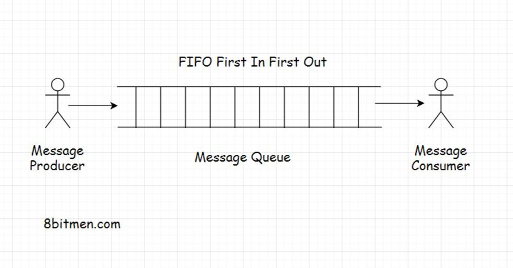
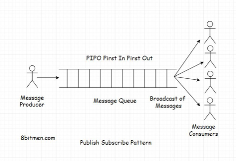
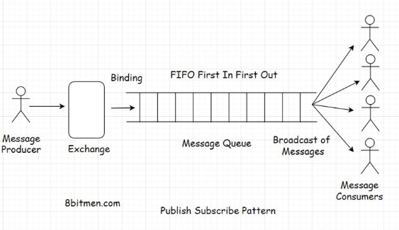
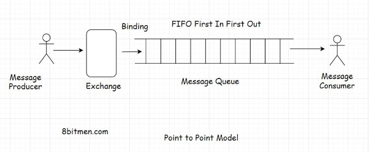
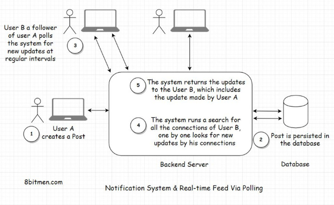
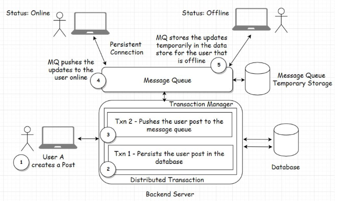

# Introduction

**What is it?** Routes messages from the source to the destination or the sender to the receiver following the FIFO (First in, first out) policy.

Support priority-based message delivery. Messages have a priority assigned to them and the queue processes the messages based on the priority set. These message queues are called ***priority queues***.

In a message queue, there is a message sender called the ***producer***, and there is a message receiver called the ***consumer***. Both the producer and the consumer don’t have to reside on the same machine to communicate.

**Features:** 

- Asynchronous
- Cross-module communication, key in service-oriented and microservices architecture
    - Enable communication in a heterogeneous environment, providing temporary storage for storing messages until they are processed and consumed by the consumer.
- Running batch jobs
- Traffic surge management

**Examples:**

- Email services
    - Sender and receiver of the email don’t have to be online at the same time to communicate with each other
    - Sender sends an email, and the message is temporarily stored on the message server until the recipient comes online and reads the message.
- User signing up to a portal
    - Sign up, they are immediately allowed to navigate to the application’s homepage, but the sign-up process isn’t complete yet
    - System has to send a confirmation email to the user’s registered email id. Then, the user has to click on the confirmation email to confirm the sign-up event.
    - Task of sending a sign-up confirmation email to the user is assigned as an asynchronous background process to a message queue
- Running batch jobs
    - Leveraging a cache to reduce application hosting costs.
        - Batch job, which updated the stock prices at regular intervals in the database, was run by a message queue
    
 

# Models

## Publish-Subscribe (pub-sub)

**What is it?** Model that enables a single or multiple producers to broadcast messages to multiple consumers. (1 to many, many to many relationships)

**Example:** 

- Consumers subscribe to a newspaper service, and the service delivers the news to multiple consumers of its service.
- Real-time news
- Updates
- Notifications on social apps to end users

---

### Exchanges

To implement the pub-sub pattern, message queues have exchanges that push the messages to the message queues based on the exchange type and the set rules.

**Different types of exchanges:**

1. **Direct Exchange:** Routes messages to queues based on an exact match between the routing key of the message and the routing key of the queue binding. It's useful for unicast routing of messages.
   - Example: In a logging system, messages with routing key "error" are sent to an error handling queue, while "info" messages go to an info processing queue.

2. **Topic Exchange:** Similar to direct, but allows for partial matching of routing keys using wildcards. It's ideal for multicast routing and more flexible routing scenarios.
   - Example: In a weather update system, messages might use routing keys like "US.NewYork.weather" or "Europe.Paris.weather". Consumers can subscribe to specific regions or all weather updates using wildcards like "*.*.weather" or "US.#".

3. **Headers Exchange:** Uses message header attributes for routing instead of routing keys. It's useful when you need to route based on multiple attributes that are more easily expressed as message headers.
   - Example: In an e-commerce system, orders might be routed based on headers like {"type": "electronics", "priority": "high"} to specific processing queues.

4. **Fanout Exchange:** Broadcasts all messages it receives to all queues bound to it, regardless of routing keys. This is the most suitable for implementing a pub-sub pattern.
   - Example: In a real-time sports score system, all updates are sent to every connected client, regardless of specific sports or teams they're interested in.

***Fanout*** exchange will fit best for implementing a pub-sub pattern. It will push the messages to all bound queues, and the consumers will receive the message broadcast. The relationship between the exchange and the queue is known as ***binding***.

 

## Point-to-Point

**What is it?** A message from the producer is consumed by only one consumer.(1 to 1 relationship)

  

# Example Implementations

## Notification System

- Imagine building a social network like Facebook using a relational database. A message queue is required to add asynchronous behavior to our application.
- User creates a post on the website, the application will persist it in the database. There will be one User table and another Post table.
- One user will create many posts, it will be a one-to-many relationship
- As we persist the post in the database, we also have to show the information posted by the user on the home page of their friends and followers, even send notifications if needed.
- How would we implement this?

---

### Approach 1 - Pull

- We will have every user on the website poll the database at regular short intervals if any of their friends have a new update
    - Query all the connections of the user from the database and then run a check on every connection one by one if any new information is posted by them
        - If there are new posts, query will pull them all and display the posts on the home page of the user’s profile.
        - Can also send the notifications to the user about the new posts
            - Help of a boolean notification counter column in the User table and adding an extra AJAX poll query from the client for new notifications
            - When the counter is true, responding to the Ajax poll request, the application sends a notification to the user

**Two Major Downsides of this Approach**

1. Polling database too often which is expensive. Consumes a lot of bandwidth.
2. Users post will not be displayed in real-time. We will have to wait until the database is polled.

---

### Approach 2 - Push

- To make it more performant, we will use the help of message queues.
- When a user creates a new post, it will have a **distributed transaction**.
    - One transaction will update the database
    - Second will send post payload to the message queue
        - Payload means the content of the message posted by the user
- When the message queue receives the message, it will asynchronously and immediately push the post to the user’s friends that are online.
    - No need to poll the DB.
- Can also use the message queue for temporary storage with a TTL for storing the payload until users friends come online
    - Have a separate key-value DB (cache) to store the user’s details required to push notifs
        - Prevents the new to poll the DB to get the friends of the user

---

#### Handling Distributed Transactions

- From the push approach we may need ways to handle distributed transactions
    - Remember there are 2 transactions, 1 for the database and another for the message queue
- Transactions failures:
    - Database persistence failure
        - Application rolls back the entire transaction and no messages will push to the message queue as well
    - Message queue failure
        - We need to figure out if we want to roll back the transaction or proceed, depends how we want to implement
            - Maybe we can write a query to poll the DB for new updates when a user refreshes the page to see if there are changes to the DB?
            - Or just rollback the entire transaction

To handle distributed transactions in a push approach using message queues, we can implement the following strategies:

1. **Two-Phase Commit (2PC):**
   - Two-Phase Commit (2PC) as explained in "Designing Data-Intensive Applications" (DDIA):
     1. Prepare Phase: The coordinator sends a prepare request to each participant. Each participant ensures it can commit the transaction and responds with "yes" or "no".
     2. Commit/Abort Phase: If all participants replied "yes", the coordinator sends a commit request. If any participant said "no" or didn't respond, the coordinator sends an abort request.
   - Participants must be able to roll back if they receive an abort, or commit if they receive a commit, even if they crash.
   - Pros: Provides atomicity across multiple nodes in a distributed system.
   - Cons: Blocking protocol (participants must wait for coordinator's decision), vulnerable to coordinator failures, and can be slow due to multiple network round-trips.

2. **Saga Pattern:**
   - Break the distributed transaction into a sequence of local transactions.
   - Each local transaction updates the database and publishes a message to trigger the next transaction.
   - If a step fails, compensating transactions are executed to undo previous steps.
   - Pros: More scalable and doesn't block resources.
   - Cons: Eventually consistent, more complex to implement and reason about.

3. **Outbox Pattern:**
   - When updating the database, also insert the message into an "outbox" table in the same transaction.
   - A separate process reads from the outbox table and publishes messages to the queue.
   - Pros: Ensures that database updates and message publishing are atomic.
   - Cons: Requires additional infrastructure to manage the outbox.

4. **Change Data Capture (CDC):**
   - Update only the database in the main transaction.
   - Use CDC to track changes in the database and publish those changes to the message queue.
   - CDC works by monitoring the database's transaction log for changes and then replicating those changes to other systems (in this case, a message queue).
   - Pros: 
     - Decouples the database update from message publishing.
     - Ensures consistency between the database and the message queue.
     - Can be used to integrate multiple systems without modifying application code.
   - Cons: 
     - May introduce slight delays in message publishing.
     - Requires additional infrastructure to implement and manage.

   Example of CDC implementation:
   1. A user creates a new post, which is saved to the database.
   2. The CDC tool (e.g., Debezium) monitors the database's transaction log.
   3. When it detects the new post, it captures the change and formats it as a message.
   4. The CDC tool then publishes this message to a message queue (e.g., Kafka).
   5. Other systems can now consume this message from the queue to react to the new post.

  

# Handling Concurrent Requests

## Traffic Surges

- Consistency models come into effect when implementing something like a Like counter
- When millions of users around the world update an entity concurrently, we can queue all the update requests in a high throughput message queue
    - Then process them one by one in a First in First Out (FIFO) approach sequentially
- System to be highly available and open to updates while remaining consistent

## Facebook Example

- Facebook uses message queue to handle a high traffic surge in LIVE streams
- When a popular person goes LIVE, there is a surge of user requests to the LIVE streaming server.
- Facebook will use a cache to intercept the traffic
    - Since data is LIVE, cache often is not populated with real-time data before requests arrive
    - This results in a [cache miss](https://www.notion.so/Caching-0c85bb25ce39428991eb9c2076f08435?pvs=21)
    - To prevent this, Facebook will:
        - Add to the **Message Queue** all user requests that is requesting the SAME data
        - Fetch the data from the server
        - Populate the cache
        - Serves the queues requests from the cache