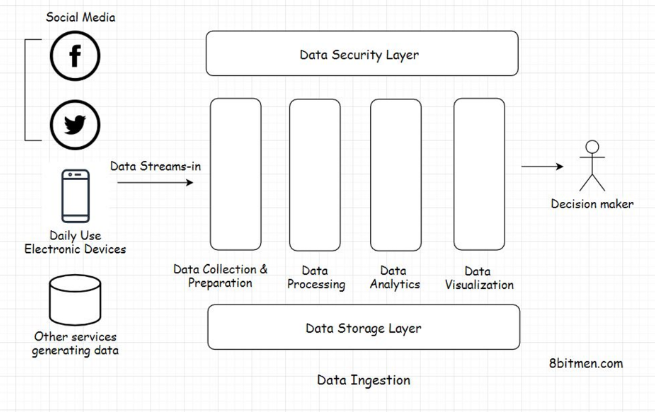
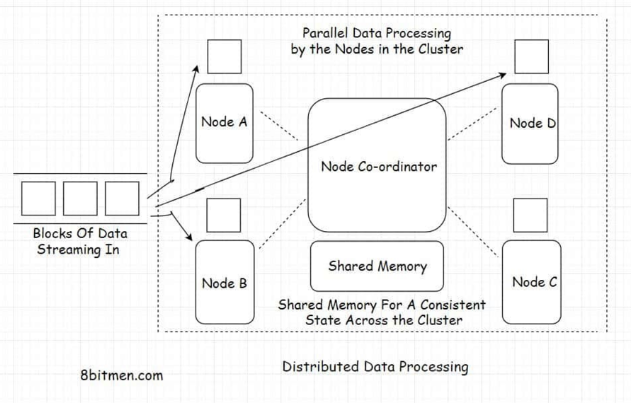
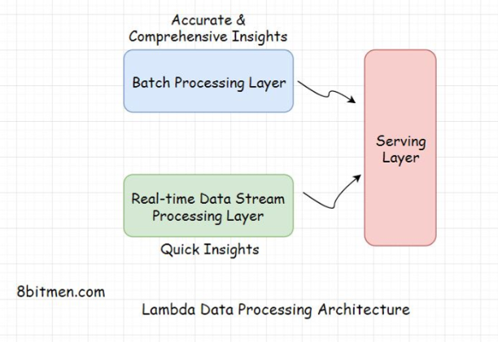
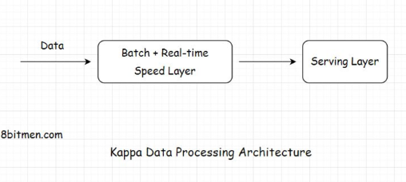

# Introductions

**What is it?** Today is largely data-driven and is progressing towards becoming entirely data-driven. Currently, Internet of Things(IoT), entities have gained self-awareness to a certain degree, and they are generating and transmitting data online at an unprecedented rate.

**Examples:**

- IoT devices can be things like drones, smartwatches, cellphones, body sensors, etc.
    - To manage these massive amount of data stream, we need a back-end systems in place to handle it.
    - Data helps us create better products, smarter decisions, run effective ad campaigns, and gain better insights to the market
- Tracking service efficiency
    - Getting an “everything is okay” signal from IoT devices metadata helps business inform of the correct functionality and uptime of products.

  

# Data Ingestion

**What is it?** A collective term for the process of collecting data streaming in from several different sources and making it ready to be processed by the system

## Layers

There are several layers to data processing:

- Data collection layer
- Data query layer
- Data processing layer
- Data visualization layer
- Data storage layer
- Data security layer

---

### 1. Data Standardization

- As seen from the diagram, data comes in many different formats/sources.
    - There are structured, unstructured, and semi-structed data.
- Every stream of data also has different semantics.
    - Comes in various speeds/sizes from social networks, IoT, machines, etc.
- To make uniform data and fit for processing, it has to be collected and converted to standardized format.
- This standardization occurs in the data collection and preparation layer.

---

### 2. Data Processing

- Once data is converted to standard format, it is routed to the data processing layer.
- This layer further processes the data based on business requirements and routed to different destinations.

---

### 3. Data Analysis

- After being routed, analytics are run on the data.
    - Predictive modeling, statistical/text analytics, etc.
- Pretty much all analytical events occur here.

---

### 4. Data Visualization

- Once analytics are run and we have valuable intel.
- The information is routed to the data visualization layer to be processed before stakeholders in a dashboard.

---

### 5. Data Storage and Security

- Moving data is highly vulnerable to security breaches.
- Need to ensure that secure movement of data along the way

 

## Different Ways of Ingesting Data

Two different ways to ingest data:

1. In real-time
    1. Preferred in systems reading medical data, heartbeats or blood pressure via IoT sensors
    2. Financial data like stock market events
2. In batches that run at regular intervals
    1. Preferred in systems that read trends over time like the popularity of a sport in a region
    2. Or weather data

## Challenges

### Slow Process

- We need to convert data since we are receiving heterogeneous data in different formats to something like JSON which could be a tedious process
- Data needs to be authenticated and processed to meet organization security standards
- Analytics information obtained from real-time processing is not that accurate or holistic since the analytics continually runs on a limited set of data
    - On the contrary, in batch processing, the entire data set is taken into account. The more time we spend studying the data, the more accurate results we get.

---

### Complex and Expensive

- Data flow process is resource-intensive.
    - Lots need to happen to prepare the data before being ingested.
- Engineering teams often come across scenarios where tools and frameworks fail to serve their needs.
    - So they have to write a custom solution from bare bones
- IoT machines in the industry are evolving at a rapid pace.

---

### Moving Data is Risky

- Moving data is vulnerable, it goes through several different staging areas
- Engineering teams have to put in additional effort and resources to ensure system meets the security standards

 

## Use Cases

- Most popular use is moving big data into Hadoop for analysis
- Streaming data from databases to Elasticsearch server
    - Used to implement search in web applications
    - Indexing data to make the products come up in search results
- Log processing
    - Massive number of logs are generated over time with microservices
    - Logs are the only way to move back in time, track errors, and study system behavior.
    - Things like ELK (elastic Logstash Kibana) stack helps
- Stream processing engines for real-time events
    - Need to handle LIVE information such as sports.
        - We need to be able to ingest data, analyze it, and figure out behavior in real-time and push it to the fans
    - Message queues like Kafka, and computation frameworks like Apache storm helps.

   

# Data Pipelines

**What is it?** Data pipelines are the core component of a data processing infrastructure. They facilitate the efficient flow of data from one point to another and enable developers to apply filters on the data streaming-in in real-time.

**Features:**

- They ensure a smooth flow of data
- They enable the business to apply filters and business logic on streaming data.
- They avert any bottlenecks and redundancy in the data flow.
- They facilitate parallel processing of the data.
- They protect data from being corrupted and so on.

Traditionally we used ***ETL systems*** to manage all of the data’s movement across the system, but one major limitation with the technology is that it doesn’t support the management of real-time streaming data.

**What is ETL?**

- **Extract** means fetching data from single or multiple data sources.
- **Transform** means transforming the extracted heterogeneous data into a standardized format based on the rules set by the business.
- **Load** means moving the transformed data to a data warehouse or another data storage location for further processing of data.

The ETL flow is the same as the data ingestion flow. The difference is just that the entire movement of data is done in batches as opposed to streaming it through the data pipelines in real-time.

  

# Distributed Data Processing

**What is it?** Distributed-data processing means diverging large amounts of data to several nodes running in a cluster for parallel processing.

Distributed environments allows us to accomplish tasks in significantly less time since tasks are shared by multiple nodes as opposed to a centralized system when it is processed sequentially.

**Example:**

- Apache Zookeeper is a node coordinator widely used in the industry.
- Since tasks are executed parallely, this makes it scalable and highly available.

 

## Technologies

### MapReduce - Apache Hadoop

- MapReduce is a programming model for managing distributed data in a cluster
    - Map involves sorting data based on a parameter
    - Reduce involves summarizing the sorted data
- The framework is used by big guns in the industry to manage massive amounts of data in their system

---

### Apache Spark

- Open source cluster computing framework
- Provides high performance for both batch and real-time in-stream processing
- Spark has a cluster manager and distributed data storage
    - Cluster manager facilitates communication between different nodes running together in a cluster
    - Distributed storage facilitates storing Big Data

---

### Apache Storm

- Distributed stream processing framework
- Primarily used for processing massive amounts of streaming data

  

# Lambda Architecture

**What is it?** Lambda is a distributed data processing architecture that leverages both the batch and the real-time streaming data processing approaches to tackle the latency issues that arise out of the batch processing approach

Preferred if batch and streaming analytics are not identical.

**How does it work?**

- Has three layers:
    - Batch layer
        - Deals with the results acquired via batch processing of the data.
    - Speed layer
        - Gets data from the real-time streaming data processing
    - Serving layer
        - Combines the results from both batch and speed layers

  

# Kappa Architecture

**What is it?** In Kappa architecture, all the data flows through a ***single data streaming pipeline*** in contrast to the Lambda architecture, which has different data streaming layers that converge into one.

It is preferred if the batch and streaming analytics results are fairly identical in a system.

**How does it work?**

- Contains two layers
    - Speed - streaming processing layer
    - Serving layer